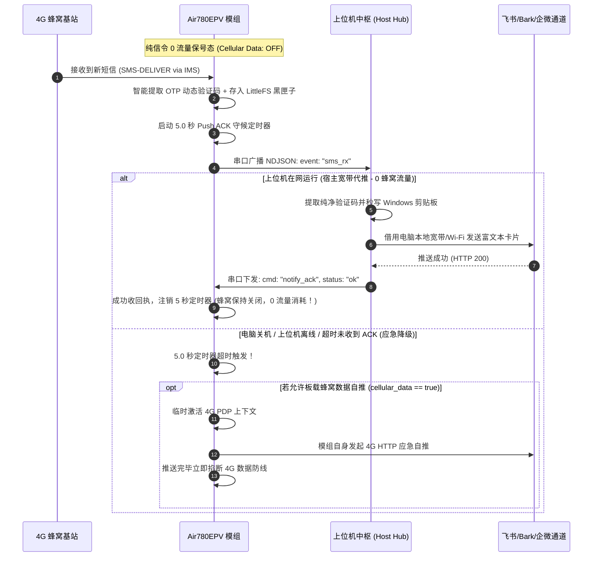

# ⚡ 合宙 Air780EPV 智能随身通信网关 (Smart Cellular Gateway)

<div align="center">

[](CHANGELOG.md)
[](LICENSE)
[](#hardware-compatibility)
[](#firmware-download)
[](#system-compatibility)
[](#push-channels)
[](tools/mcp_server/)
[](#quickstart)
[](https://github.com/ocean1798/Air780EPV-Smart-Gateway/pulls)

**全网通 4G 短信转发 | 电信 SMS over IMS | 智能验证码(OTP)提取 | 纯信令 0 流量保号 | AI Agent FastMCP 物理通信工具 | Windows 免安装独立桌面端**

[English Abstract](#english-abstract) • [方案对比](#comparison) • [兼容硬件](#hardware-compatibility) • [推送渠道](#push-channels) • [固件获取](#firmware-download) • [上位机使用与兼容性](#host-gateway) • [快速上手](#quickstart) • [API与MCP](#api-mcp) • [常见问题 FAQ](#faq)

</div>

---

<a id="english-abstract"></a>
### English Abstract

> **Air780EPV-Smart-Gateway** is an industrial-grade, zero-traffic 4G Cat.1 cellular dongle & IoT communication gateway powered by Air780EPV (Cortex-M4F EC718P-V) and LuatOS.
> It features **native VoLTE / SMS over IMS** (full China Telecom/Mobile/Unicom/CBN support), **broadband-priority proxy push with Push ACK** (0 cellular traffic consumed when connected to a host PC), **multi-channel notification dispatch** (Feishu/DingTalk/WeCom/Bark/Custom Webhook), **anti-OOM cursor pagination** for low-RAM microcontrollers, **FastMCP AI Agent physical communication integration**, and an out-of-the-box **standalone 27MB Windows desktop app**.

---

<a id="comparison"></a>
## 📊 为什么选择本项目？ (方案横向对比)

在 4G 短信转发与随身通信领域，常见方案存在“电信收不到短信”、“频繁扣蜂窝流量”、“连续刷新板端 OOM 崩溃”、“需要装 Python 环境”等诸多痛点。本项目通过微内核与上位机深度协同，实现了全面升级：

| 评估维度 | 本项目 (Air780EPV Smart Gateway) | 传统开源脚本 (如经典 Air780E 转发) | 安卓备用机方案 (SmsForwarder 等) | 普通商业短信猫 / AT 模块 |
| :--- | :---: | :---: | :---: | :---: |
| **电信 4G 支持** | **原生 VoLTE / SMS over IMS**<br>移动/联通/电信/广电四网秒收 | ❌ 旧款 EC618 无 IMS 栈<br>电信 4G 无法接收短信 | 需备用手机与常驻供电<br>电池鼓包与发热隐患 | 依赖庞大硬件与旧驱动<br>配置繁琐 |
| **插电脑流量消耗** | **严格 0 字节 (宿主宽带代推)**<br>Push ACK 握手回写注销板推 | ❌ 每次收到短信一律由板卡发 HTTP<br>消耗蜂窝数据与套餐话费 | 依赖手机 Wi-Fi<br>偶发切回蜂窝偷跑流量 | 视上位机方案而定 |
| **验证码提取体验** | **秒级工业级 3 层正则**<br>Windows 剪贴板直写 + 气泡双发 | 仅简单转发纯文本<br>需人工二次寻找截取 | 依赖第三方 OCR 或系统规则<br>延迟较高 | 需二次开发编写正则 |
| **微内核防 OOM 韧性** | **`h:gen:offset` 游标懒加载**<br>峰值 RAM < 12KB，抗刷耐压 | ❌ 一次性全量吐出历史短信<br>多次刷新直接堆耗尽复位 | 安卓系统 RAM 充足<br>但系统进程极易被保活杀掉 | 无板载轻量 Web 概念 |
| **端口漂移自愈** | **`19D1:0001` + `x.6` 拓扑探测**<br>热拔插 1.5 秒无感自愈 | ❌ 必须写死 COM 口<br>重启或换口直接报端口不存在 | 不涉及物理串口 | 写死 COM 口<br>需人工经常重新选择 |
| **桌面端交互形态** | **单文件 Exe (27.2MB) 绿色免装**<br>系统托盘常驻 + Edge 原生独立 App | 需手动安装 Python 与依赖<br>黑框终端运行易误关 | 手机屏幕触控<br>无法与 PC 桌面生产力协同 | 商业工控软件界面陈旧<br>无现代 Web/REST API |
| **AI Agent 现代生态** | **内置 FastMCP 物理服务器**<br>7 大标准工具对接 Claude/Cursor | ❌ 无现代 AI 协议支持 | 仅支持 Webhook / HTTP | 仅支持老旧 AT 指令 |

---

<a id="hardware-compatibility"></a>
## 📱 固件兼容性与硬件资源要求

本项目板端固件与微内核脚本面向合宙（AirM2M）全系 Cat.1 蜂窝模组与开发板研发，底层深度适配移芯（Eigencomm）EC718 与 EC618 芯片平台。

### 1. 模组与开发板兼容性矩阵

| 硬件型号 / 开发板 | 主控 SoC / 架构 | 移动 / 联通 / 广电 | 电信 4G 短信 (SMS over IMS) | 来电 0 话费秒挂 | 4G 随身上网 (RNDIS) | 固件空中热更 (FOTA) | 选型建议与运行说明 |
| :--- | :---: | :---: | :---: | :---: | :---: | :---: | :--- |
| **Air780EPV**<br>*(主力推荐)* | **移芯 EC718P-V**<br>(Cortex-M4F) | **100% 完美支持** | **100% 原生支持**<br>*(原生集成 IMS 协议栈)* | **支持** | **支持** | **支持** | **【强烈推荐】** 唯一兼备全网通电信短信、超强性能与丰富外设的主力硬件，首发必选。 |
| **Air780E** | 移芯 EC618<br>(Cortex-M3) | **支持** | ❌ **不支持**<br>*(硬件缺少 IMS 栈)* | **支持** | **支持** | **支持** | 适合手头已有设备升级。仅建议使用移动或联通卡；插入电信卡将无法接收 4G 短信。 |
| **Air780EC** | 移芯 EC618<br>(Cortex-M3) | **支持** | ❌ **不支持** | **支持** | **支持** | **支持** | 基础通信性能与 Air780E 一致，兼容移动与联通卡短信收发及 RNDIS 随身上网。 |
| **Air700E** | 移芯 EC618<br>(Cortex-M3) | 仅支持中国移动<br>(B3/B8 频段) | ❌ **不支持** | **支持** | **支持** | **支持** | 极限低成本超小尺寸模组。硬件射频仅覆盖中国移动频段，仅支持移动卡。 |
| **Air780EHM / EHV** | 移芯 EC618 衍生平台 | **支持** | ❌ **不支持** | **支持** | **支持** | **支持** | 电源增强款或工控行业款，基础短信转发与上位机通信指令集完全通用。 |

> **⚠️ 为什么电信 4G 短信必须选 Air780EPV？**  
> 中国电信 4G 网络不支持传统 2G/3G CSFB 回落，所有的短信下发必须通过 **SMS over IMS (VoLTE)** 隧道承载。旧款 EC618（Air780E/Air700E）由于芯片物理 ROM 限制未烧录 IMS 协议栈，因此无法解码电信短信信令。**如需使用电信卡，请务必选购合宙 Air780EPV 开发板。**

### 2. 存储空间 (Flash) 要求与分区账本
- **模组内置 Flash**：要求模组内置 Flash ≥ **4MB**（合宙 780 系列全系内置 4MB Nor Flash，开箱完全满足）；
- **底层固件分区 (Core)**：占用约 **1.5MB ~ 2.0MB**；
- **脚本执行分区 (Script Area)**：基址为 `0x00324000`，配额空间 256KB ~ 512KB；本项目全部 Lua 业务脚本打包后仅约 **20KB**，预留了充足的拓展空间；
- **板载 LittleFS 文件系统 (黑匣子脱机存储)**：
  - 模组分配给用户持久化存储的 LittleFS 分区需 ≥ **128KB**（本项目标准配置为 128KB）；
  - 本网关业务与配置常驻占用约 **29KB**，剩余 **99KB** 专用于短信黑匣子环形存储（断电不丢信，支持容纳数百条短信并自动循环覆盖）。

### 3. 运行内存 (RAM / 堆内存 Heap) 要求与防 OOM 设计
- **系统可用堆内存**：移芯 SoC 提供给 Lua 虚拟机的总堆内存配额仅为 **128KB**（极限精简嵌入式环境）；
- **开机常驻基线**：模组开机入网、VoLTE 协议栈就绪且网关常驻运行时，系统静态内存占用仅 **53KB**，空闲内存保持在 **75KB**（空闲率 58.6%），远离 128KB 崩溃红线；
- **防 OOM 峰值内存控制**：
  - 传统开源脚本在被上位机或浏览器请求时，往往一次性全量 dump 所有短信，瞬时内存飙升直接引发 MCU 堆耗尽（OOM）看门狗重启；
  - 本网关固件独家采用 **`h:gen:offset` 游标分页技术**，单批严格限制 15 条且正文截断至 256 字节，**执行查询拉取时动态内存增量严格压制在 12KB 以内**，即使连续高频恶意刷新也能稳健在安全水位线内运行。

### 4. 固件底包 (SOC 镜像) 版本要求
- **Air780EPV** 模组必须配合 `LuatOS-SoC_V2001_EC718PV_CLOUD.soc` 及以上版本使用（集成 VoLTE / IMS 协议栈）；
- **Air780E / Air700E** 模组必须配合 `LuatOS-SoC_V1113_EC618.soc` 及以上版本使用；
- **注意**：底包必须使用官方精简底包（CLOUD 版），切勿烧录带有复杂 UI / 字体库的未精简全功能底包，以确保留出足够系统堆内存给网络协议栈。

---

<a id="push-channels"></a>
## 🔔 支持的推送渠道全景

当短信棒收到新短信、验证码或来电拦截事件时，系统支持通过以下多渠道将富文本卡片即时投递给您：

| 推送渠道 | 呈现形式 | 渠道特性与核心亮点 | 配置所需参数 |
| :--- | :--- | :--- | :--- |
| **飞书机器人 (Feishu / Lark)** | **富文本互动卡片**<br>(Interactive Card) | • 动态突出显示高亮验证码<br>• 内置一键复制验证码 Action 按钮<br>• 展示发件人、归属时间、模组电量与信号 | `feishu.url`: 飞书群自定义机器人的完整 Webhook 地址 |
| **钉钉机器人 (DingTalk)** | **Markdown 卡片消息** | • 格式排版清晰整洁<br>• 支持 PC 端与移动端即刻提醒与免打扰设置 | `dingtalk.url`: 钉钉群机器人的 Webhook 地址 |
| **企业微信机器人 (WeCom)** | **Markdown / 文本消息** | • 无缝融入工作群组与移动办公<br>• 毫秒级到达率与多端同步推送 | `wecom.url`: 企业微信内部群机器人的 Webhook 地址 |
| **Bark (iOS)** | **原生极速通知** | • iOS 端最优体验，极简纯净<br>• 支持通知铃声、角标、分组管理<br>• 点击通知自动将动态验证码复制到 iPhone 剪贴板 | `bark.url`: 形如 `https://api.day.app/YOUR_KEY/` 的推送地址 |
| **自定义通用 Webhook** | **HTTP POST JSON** | • 支持对接任意自建服务、Home Assistant、Server酱、PushPlus、Telegram Bot 等<br>• 携带结构化 JSON 数据载荷 (发件人、时间戳、正文、提取的 OTP) | `webhook.url`: 目标接收端 API 的 HTTP/HTTPS 地址 |

### 渠道配置示例 (`tools/host_gateway/gateway_config.json`)
在上位机目录中的 `gateway_config.json`（可直接从 `gateway_config.example.json` 复制）中，您可以自由启用单个或多个推送渠道（支持多渠道并发推送）：
```json
{
  "system": {
    "auto_copy_otp": 1
  },
  "feishu": {
    "enable": 1,
    "url": "https://open.feishu.cn/open-apis/bot/v2/hook/YOUR_FEISHU_BOT_TOKEN",
    "secret": ""
  },
  "wecom": {
    "enable": 0,
    "url": "https://qyapi.weixin.qq.com/cgi-bin/webhook/send?key=YOUR_KEY"
  },
  "dingtalk": {
    "enable": 0,
    "url": "https://oapi.dingtalk.com/robot/send?access_token=YOUR_TOKEN",
    "secret": ""
  },
  "bark": {
    "enable": 0,
    "url": "https://api.day.app/YOUR_BARK_KEY/",
    "group": "Air780EPV",
    "sound": "minuet"
  },
  "webhook": {
    "enable": 0,
    "url": "https://your-server.com/api/sms_receiver",
    "method": "POST"
  }
}
```

---

<a id="firmware-download"></a>
## 💾 固件获取与免按键烧录指南

### 1. 固件底包与源码文件说明
本项目代码仓库已自包含完整开源的固件与逻辑脚本，开箱即用，无需到处翻找：
- **官方 SOC 底包 (`deploy/core/`)**：
  - `LuatOS-SoC_V2001_EC718PV_CLOUD.soc`：针对 **Air780EPV** 模组深度定制优化的官方精简底层固件（集成 VoLTE / IMS / HTTP / FSKV 驱动）；
  - `LuatOS-SoC_V1113_EC618.soc`：针对 Air780E / Air700E 模组的官方精简底包；
  - 亦可前往 [合宙官方固件发行站](https://gitee.com/openLuat/LuatOS) 或通过 Luatools 自动在线拉取最新固件。
- **业务脚本源码 (`deploy/smart-gateway-780epv/`)**：
  - 包含了开机引导、短信提码、0 话费秒挂、Push ACK 闭环、LittleFS 环形黑匣子存储等全部 Lua 脚本源码。

### 2. 刷机方式 A：2.5 秒全自动免按键烧录（已刷入底包的日常极速更新）
适合已刷入过一次底层 SOC 的模组。利用配套的自动化脚本一键完成（无需手工按物理 BOOT 键，无需手动点击鼠标）：

#### 📋 必须满足的前置条件（请逐项核对）：
1. **硬件连接与线缆**：
   - **必须使用全功能 Type-C 数据线**（具备 USB 数据传输引脚；切勿使用仅供电的两芯充电线，否则无法枚举虚拟串口）；
   - 将开发板插上电脑 USB 口后，**请长按板载 `Power` 开机键约 1.5 ~ 2 秒**（模组 `POW` 红灯常亮，待 `NET` 绿灯闪烁即表示开机入网成功）。
2. **Windows 芯片驱动就绪**：
   - 电脑必须已安装移芯平台 USB 驱动（**合宙 CH343 / 移芯 EC718 & EC618 通用 CDC 驱动**，可从合宙官方文档下载）；
   - 正确识别时，Windows“设备管理器”中的“端口 (COM 和 LPT)”将出现带有 `19D1:0001` 特征的 3 个虚拟串口（包括 `x.6` VUART_0 用户串口）。
3. **合宙官方烧录工具 (Luatools_v3) 支持**：
   - **为什么源码仓库未直接打包 80MB 的 `Luatools_v3.exe`？**
     - `Luatools_v3.exe` 单文件高达 80MB 且为合宙闭源版权工具。若直接提交进 Git 树，不仅让本仅 2MB 的轻量源码库体积膨胀 4000%、严重拖慢国内外用户的克隆速度，且存在第三方二进制合规问题。
   - **自动化脚本零门槛环境自愈**：
     - 本项目的 `tools/Luatools/flash_smart_gateway.py` 内置**自动化下载与工程路径自适应引擎**；
     - 若本地缺失该工具，脚本首次运行会自动提示并**直接从合宙官方 CDN 高速拉取正版免安装 `Luatools_v3.exe`**；
     - 脚本还会**自动读取当前机器绝对路径**并生成 `project/smart-gateway-780epv.ini` 工程配置，抹平跨机器克隆路径不一致问题。
4. **Python 运行环境与依赖**：
   - 需要 Python 3.8+ 并安装 `pywin32`（若已运行 `pip install -r requirements.txt` 则已自动包含）：
     ```bash
     pip install pywin32
     ```

#### 🚀 开始全自动免按键烧录：
满足上述前置条件后，在项目根目录下直接运行：
```bash
python tools/Luatools/flash_smart_gateway.py
```
**底层自动化过程**：
脚本通过 Win32 API 自动定位 Luatools 窗体句柄并模拟投递 `BM_CLICK` 点击“仅下载脚本”，模组收到 `BOOT_CP` 软复位指令后 2.5 秒内自动从运行态重启切入 ROM Bootloader（COM9）并高速灌入最新 Lua 脚本，烧录完毕模组自动重启上线！

### 3. 刷机方式 B：全新出厂模组首次全量初始化（底层 Core + 脚本）
**⚠️ 关键注意**：若您拿到的是全新出厂未烧录过的 Air780EPV 板卡（通常带原厂出厂 AT 固件），模组内尚未植入 LuatOS 底层，无法响应纯脚本更新指令。**首次使用请务必按以下步骤执行一次全量烧录**：
1. 从 [合宙官方文档中心](https://docs.openluat.com/common/Luatools/) 或 [官方 CDN 直链下载](https://cdn18.luatos.com/files/exe/Luatools_v3.exe) 获取免安装烧录工具 **Luatools_v3**；
2. 打开 Luatools，点击主界面右上角 **【项目管理测试】**；
3. 新建一个项目（例如命名为 `Air780EPV网关`）；
4. 在右侧 **【底层 Core】** 处点击浏览，选择本项目内置的官方底包：
   - Air780EPV 选择：`deploy/core/LuatOS-SoC_V2001_EC718PV_CLOUD.soc`
   - Air780E/700E 选择：`deploy/core/LuatOS-SoC_V1113_EC618.soc`
5. 在 **【脚本文件】** 处点击添加，选中本项目 `deploy/smart-gateway-780epv/` 目录下的所有 `.lua` 文件；
6. 勾选 **【全量烧录】**；
7. 将开发板连上 USB，长按开机键开机，点击界面的 **【下载底层和脚本】** 即可完成基座注入；
8. 首次全量初始化完成后，后续任何业务更新便可永久使用【刷机方式 A】实现 2.5 秒全自动免交互秒刷！

---

<a id="host-gateway"></a>
## 🖥️ 上位机使用指南与系统兼容性

<a id="system-compatibility"></a>
### 1. 系统兼容性要求与运行形态

| 操作系统环境 | 兼容支持度 | 运行形态与功能特性 | 适用人群与场景 |
| :--- | :---: | :--- | :--- |
| **Windows 10 / 11 (64-bit)** | **【官方主推】**<br>⭐⭐⭐⭐⭐ | • **单文件绿色免装版 (`Air780EPV-Gateway.exe`)**<br>• 内置 Python 运行时，双击即用<br>• 原生系统托盘天线图标常驻<br>• 自动调起独立 Edge/Chrome 原生 App 窗口<br>• 动态验证码自动直写 Windows 系统剪贴板 | 日常个人电脑、随身办公本、桌面主力机 |
| **Linux 发行版**<br>*(Ubuntu / Debian / CentOS / 飞牛 fnOS / 群晖 DSM)* | **完全兼容**<br>⭐⭐⭐⭐⭐ | • 通过 Python 3.8+ 源码运行<br>• 提供 17800 (Hub) 与 17801 (Web) 网络服务<br>• 支持 systemd 守护进程常驻<br>• 完美适配 NAS、家用服务器 24 小时不断电短信转发 | 家用 NAS (飞牛/群晖)、工控主机、软路由、树莓派 |
| **macOS**<br>*(x86_64 / Apple Silicon)* | **完全兼容**<br>⭐⭐⭐⭐ | • 通过 Python 3.8+ 源码运行<br>• 自动枚举 USB 虚拟串口并开启本地管理看板 | Mac 开发者本地二次开发与测试 |
| **现代浏览器支持** | **完全兼容** | • 基于现代标准构建：Chrome 90+, Edge 90+, Safari 14+, Firefox 88+<br>• 支持 SSE (Server-Sent Events) 实时推流、CSS Grid 与响应式触底懒加载 | PC 桌面浏览器、手机移动端网页查阅 |

### 2. 上位机核心功能操作说明
- **硬件运行全景看板**：实时显示当前 4G 蜂窝信号格数、RSRP、核心芯片温度、供电电压、连续开机运行时间及网络状态；
- **短信收件箱与历史黑匣子**：
  - 基于三层防 OOM 游标分页技术，滚动至页面底部自动无感加载历史短信；
  - 提取的动态验证码拥有独立胶囊标签，点击任意短信卡片即可一键复制验证码；
- **4G 随身上网与蜂窝数据物理开关**：
  - **USB 随身上网 (RNDIS 网卡)**：按需开启，让电脑直接通过 4G 蜂窝网络上网；
  - **板载蜂窝数据通信 (PDP 防线)**：默认严格关闭以实现 0 流量保号；
- **主动短信发射机**：在界面直接输入目标手机号码与正文，驱动硬件 4G 射频直接发射短信；
- **模组安全软复位**：遇到极端网络波动时，可在界面下发一键安全重启指令，硬件瞬间软重启并重新入网。

---

<a id="features"></a>
## 🌟 核心特性与架构亮点

### 1. 全网通通信与智能验证码中枢 (P0 / P2)
- **四网通原生支持**：基于移芯 EC718P-V Cortex-M4F 架构，原生支持 VoLTE 与 IMS 协议栈，**彻底终结电信 4G 短信依赖 SMS over IMS 的硬件死穴**，移动、联通、电信、广电全面秒收；
- **智能 OTP 防误报提码**：内置工业级 3 层正则引擎，精准剥离 4~8 位动态验证码，自动剔除发件人尾号、客服电话、订单号与金额等干扰数字；
- **0 话费来电秒挂**：来电振铃 0.1 秒内纯信令毫秒级切断通话（`cc.hangUp()`），双方账单严格 0 元，同时生成秒挂拦截通知；
- **主动短信代发**：上位机下发指令驱动 4G 射频发射短信，支持异步基站投递回执监听。

### 2. 双重默认关闭与纯信令 0 流量保号 (AIR-08 / AIR-17)
- **控制面物理级隔离**：出厂默认彻底掐断 4G 随身上网（USB RNDIS 网卡）与板载蜂窝数据通信（PDP 上下文）；
- **宿主宽带优先代推**：只要短信棒连着电脑且上位机在运行，无论板端蜂窝开或关，一律优先借用电脑本地宽带/Wi-Fi 代发飞书/Bark/企微/钉钉，**手机卡流量消耗锁定为 0 字节**；
- **Push ACK 握手与超时降级闭环**：
  - 模组收信后启动 5.0 秒定时器等待上位机；
  - 上位机代推成功后立即向串口回传 `notify_ack [ok]`，模组收到后注销定时器；
  - 若上位机退出或电脑关机，5 秒超时后模组自动按蜂窝状态触发 4G HTTP 应急直推；
- **128KB LittleFS 脱机黑匣子**：板载掉电不丢存储，断网脱机也能安全存储短信存档。

### 3. 三层防 OOM 游标分页与触底无感懒加载
- **微内核极致内存保护**：针对 MCU 仅 128KB 极限堆内存，落地 `h:gen:offset` 游标分页机制，单批锁定 15 条且正文截断至 256 字节，峰值 RAM 恒定在 12KB 以内，杜绝连续刷新导致板端 OOM 重启；
- **后端参数防御清洗**：上位机 Web 层严密过滤 `"0"`、`"null"` 等非法游标，避免底层正则解析异常；
- **前端双保险懒加载**：基于 `IntersectionObserver` 160px 阈值哨兵感知与三级判空，配合零增量熔断机制，彻底消除死循环请求风暴。

### 4. 串口自适应动态探测与热拔插漂移自愈
- **全自动识别接管**：弃用传统硬编码 COM 口，上位机通过 `19D1:0001` 拓扑特征自动定位 `x.6` (VUART_0 用户口)，自适应匹配 `COM8`、`COM16` 等系统动态分配端口；
- **断线无感重连**：遭遇拔插或模组复位引发端口漂移时，中枢 1.5 秒周期性重试自愈，上层 SSE 推流与 Web 界面完全无感。

### 5. 单卡极致纯净体验 (开源稳定版)
- **单卡稳定版 (`tools/host_gateway/`)**：面向普通个人与随身办公，去除一切多余卡槽横条干扰，纯净极简，一键打包为单文件 `Air780EPV-Gateway.exe`；
- *(注：多卡槽硬件集群版基于 `DongleSessionPool` 弹性管理多卡卡池业务，定位为企业级独立增强版，独立维护，不包含在当前单卡开源分发包中)*。

### 6. 开箱即用桌面整合与交付标准 (AIR-14)
- **单文件免安装分发**：基于 PyInstaller 打包，内置 Python 运行时、Pyserial 及自包含 SPA 页面（体积仅 27.27 MB）；
- **系统级体验**：集成 Win32 Mutex 单实例防争抢、系统托盘常驻，自动唤起 Edge/Chrome 原生 App 独立应用窗口（`--app=http://127.0.0.1:17801`）；
- **剪贴板秒级直写**：捕获验证码瞬间直写 Windows 剪贴板，支持桌面即刻 `Ctrl+V` 粘贴。

### 7. AI Agent 调度与平台生态扩展 (AIR-06 / AIR-09 / AIR-18)
- **FastMCP 物理通信服务器**：提供 7 大标准工具，让 AI 助手直接收发短信、智能守候验证码；
- **七牛云 FOTA 空中更新**：内置标准 92 字节 LuatOS 头注入与 LZMA 压缩流水线，支持拨打指定管理员白名单电话触发免插线固件升级；
- **《硅基涌现》官方插件**：符合 Plugin Platform v4.0 规范，提供网关资产看板与双向桥接。

---

<a id="sequence"></a>
## 🔄 通信中枢工作时序 (Mermaid)



---

## 📂 工程文件架构全景

```text
Air780EPV-Smart-Gateway/
├── README.md                          # 【自述文件】项目全景、架构指引与 FAQ
├── LICENSE                            # 【开源许可】MIT License 授权协议
├── requirements.txt                   # 【依赖清单】上位机与工具依赖清单
├── CHANGELOG.md                       # 【更新日志】遵循 SemVer 规范的演进记录
├── .gitignore                         # 【忽略规则】严密阻断二进制包与私有凭据
│
├── specs/                             # 【权威架构与规范源】
│   ├── smart-gateway-architecture.md  # 智能通信网关全景架构设计、通信时序与交付规范
│   ├── api-and-integration-guide.md   # 物理串口 NDJSON、Web REST API 与 SSE 事件流开发者手册
│   ├── open-source-release-guide.md   # GitHub 开源治理与瞬时无痕发布流水线规范
│   ├── board-comparison.md            # Air780EPV / 780E / 700E 硬件差异与运营商兼容选型指南
│   ├── hardware-spec.md               # 引脚图谱、电气特性、USB 复合设备枚举定义
│   └── flashing-and-toolchain.md      # Luatools 静默免按键刷机流程与 CLI 工具链使用说明
│
├── deploy/                            # 【板载固件与代码】
│   ├── core/                          # 官方 SOC 底包 (LuatOS-SoC_V2001_EC718PV_CLOUD.soc)
│   └── smart-gateway-780epv/          # 模组主线业务脚本包 (烧录至板载 LittleFS)
│       ├── main.lua                   # 开机引导、系统状态机与启动守候
│       ├── config.lua                 # 模组核心静态配置
│       ├── sms_service.lua            # 短信接收、正则提码与主动代发
│       ├── call_service.lua           # 0 话费来电秒挂与 FOTA 电话暗号识别
│       ├── notify_service.lua         # 5 秒 Push ACK 守候定时器与降级自推引擎
│       ├── storage_service.lua        # 128KB LittleFS 游标环形存储驱动
│       ├── fota_service.lua           # 七牛云流式固件热更新引擎
│       └── serial_comm.lua            # VUART_0 用户口 NDJSON 分帧与粘包处理
│
├── tools/                             # 【上位机控制端与构建工具链】
│   ├── host_gateway/                  # 【单卡稳定纯净版】
│   │   ├── gateway_hub.py             # 物理串口独占与动态探测中枢 (TCP 17800)
│   │   ├── gateway_web.py             # 轻量 Web 控制台服务 (HTTP 17801)
│   │   ├── gateway_app.py             # 桌面托盘、单例 Mutex 与 Edge 窗口唤起宿主
│   │   ├── build_exe.py               # PyInstaller 单文件构建脚本
│   │   └── web/index.html             # 纯净现代前端控制台 (无卡槽横条，触底懒加载)
│   │
│   ├── mcp_server/                    # 【AI Agent 协同中枢】
│   │   ├── server.py                  # FastMCP 标准 stdio 服务 (提供 7 大物理工具)
│   │   └── gateway_driver.py          # 对接 Hub IPC 17800 端口的长连接驱动
│   │
│   ├── fota/                          # 【FOTA 空中热更流水线】
│   │   └── publish_ota.py             # 原生 LuaDB 生成、92B 头注入、LZMA 压缩与 CDN 推流
│   │
│   ├── publish_to_github.py           # 【开源发布管道】工业级单源无痕瞬时推流工具
│   └── Luatools/flash_smart_gateway.py # 免安装 2.5 秒静默全自动刷机脚本
│
├── plugins/                           # 【生态扩展】
│   └── silicon-emergence-cellular/    # 《硅基涌现》Plugin Platform 4.0 官方插件
│
└── test_*.py                          # 【实机端到端自动化验收套件】
    ├── test_air17_push_ack.py         # Push ACK 握手与超时降级全场景自测
    ├── test_air18_call_fota_e2e.py    # 电话暗号拦截与 FOTA 热更全链路闭环测试
    ├── test_sms_lazy_load_live.py     # 黑匣子短信触底无感懒加载实测
    └── test_zero_traffic_live.py      # 0 流量纯信令保号与宽带代发实测
```

---

<a id="quickstart"></a>
## 🚀 快速上手与运行指引

### 方式一：直接运行 Windows 免安装单文件版（推荐普通用户）
适合日常作为随身短信棒使用，零 Python 运行环境依赖：
1. 前往 GitHub **[Releases 页面](https://github.com/ocean1798/Air780EPV-Smart-Gateway/releases)** 下载最新的 `Air780EPV-Gateway-v1.2.5.zip`；
2. 解压后双击运行 **`Air780EPV-Gateway.exe`**；
3. 程序自动在后台常驻运行，系统托盘出现天线图标，并自动调起 Edge 原生独立 App 窗口：
   - 本地 Web 控制台：`http://127.0.0.1:17801`
   - 底层通信中枢：`127.0.0.1:17800`

### 方式二：从 Python 源码启动（开发者 / Linux / NAS 用户）
```bash
# 1. 克隆代码并安装依赖
git clone https://github.com/ocean1798/Air780EPV-Smart-Gateway.git
cd Air780EPV-Smart-Gateway
pip install -r requirements.txt

# 2. 复制配置文件模板
cp tools/host_gateway/gateway_config.example.json tools/host_gateway/gateway_config.json
# 编辑 gateway_config.json 填入飞书/Bark/钉钉 Webhook 地址

# 3. 启动中枢服务
cd tools/host_gateway
python gateway_app.py
```

### 方式三：模组固件烧录与极速更新
- **若拿到全新出厂未烧录的 Air780EPV 板卡**：请参考上文【刷机方式 B】，通过 Luatools 完成首次全量烧录（底层 Core + 脚本）；
- **已刷入底包的日常业务极速更新**：
  在项目根目录下直接运行全自动免按键脚本（2.5 秒全自动免人工下载与复位）：
  ```bash
  python tools/Luatools/flash_smart_gateway.py
  ```
  模组自动重启后 NET 网络灯闪烁即代表开机入网成功。

---

<a id="api-mcp"></a>
## 🔌 接口协议与开发者指引

### 1. Web REST API 摘要 (端口 17801)
| 接口 | 方法 | 说明 | 核心参数与响应 |
| :--- | :---: | :--- | :--- |
| `/api/status` | `GET` | 硬件全景看板 | 返回 CSQ、RSRP、温度、电压、RNDIS状态、数据网络状态、Uptime |
| `/api/history`| `GET` | 游标分页拉取短信 | `limit=15&cursor=h:gen:offset`，返回 `has_more`、`cursor`、`total` |
| `/api/events` | `GET` | SSE 实时事件流 | 长连接推流 `sms_rx`、`call_rx`、`status_update` |
| `/api/sms/send` | `POST` | 4G 射频主动代发短信 | `{"phone": "...", "content": "..."}` |
| `/api/control/rndis` | `POST` | 启闭 4G 随身上网 | `{"enable": true/false}` |
| `/api/control/data` | `POST` | 切换板端 4G 蜂窝数据 | `{"enable": true/false}` (0 流量保号防线) |
| `/api/control/reboot` | `POST` | 安全软复位模组 | `{"reason": "..."}` |

### 2. FastMCP 配置指引 (对接 Claude Desktop / Cursor / Pi)
在 AI 客户端配置 `.mcp.json`：
```json
{
  "mcpServers": {
    "air780epv": {
      "command": "python",
      "args": ["tools/mcp_server/server.py"]
    }
  }
}
```
**可用 MCP 工具集**：
- `air780epv_cellular_get_status`：查阅模组信号、温度、电压与网络状态；
- `air780epv_cellular_wait_for_otp`：毫秒级守候并智能提取短信动态验证码；
- `air780epv_cellular_send_sms`：驱动 4G 射频代发短信；
- `air780epv_cellular_get_history`：查阅脱机黑匣子短信存档；
- `air780epv_cellular_toggle_rndis`：动态启闭 USB 4G 随身上网；
- `air780epv_cellular_toggle_board_data`：切换板载蜂窝数据通信；
- `air780epv_cellular_reboot_gateway`：下发软复位指令安全重启模组。

---

<a id="faq"></a>
## ❓ 常见问题与排坑指南 (FAQ)

1. **问：开发板插到电脑上为什么没有串口输出或指示灯不亮？**
   - 答：合宙 Air780EPV 带有软开关机逻辑。连接 Type-C 数据线后，**请长按板载 `Power` 开机键约 1.5 ~ 2 秒**，待 `NET` 绿灯开始闪烁即代表开机驻网成功。
2. **问：电信手机卡为什么收不到验证码？**
   - 答：电信 4G 短信强制依赖 **SMS over IMS** 技术。必须选用原生支持 VoLTE/IMS 的 **Air780EPV** 模组（移芯 EC718P-V 架构）。旧款 Air780E（EC618）因无 IMS 协议栈无法接收电信短信。
3. **问：连着电脑时会扣手机卡流量吗？**
   - 答：**严格 0 流量消耗**。上位机在运行时，短信通知一律借用电脑本地 Wi-Fi/宽带代推，并向模组发送 Push ACK 注销板端自推，手机卡蜂窝数据默认物理关闭。
4. **问：Windows 提示“无法识别的 USB 设备”或找不到端口？**
   - 答：请安装合宙官方提供的通用 USB 驱动（移芯 EC718/EC618 CDC 驱动），设备管理器中识别出带有 `19D1:0001` 特征的 3 个虚拟串口（包括 `x.6` 用户口）即可自动识别。

---

## 🤝 鸣谢与参考 (Credits)

- [合宙开源社区 (OpenLuat)](https://gitee.com/openLuat/LuatOS)：感谢合宙团队打造的优秀嵌入式微内核与 LuatOS-SoC 开源生态；
- [air780e-forwarder](https://github.com/lageev/air780e-forwarder)：感谢经典转发脚本前辈的底层轮子与启发；
- [luatos_notify](https://github.com/jhcn/luatos_notify)：感谢社区对多渠道通知封装的探索；
- [FastMCP](https://github.com/jlowin/fastmcp)：提供优雅简洁的 Python MCP 工具开发框架。

---

## 📄 开源协议 (License)

本项目采用 [MIT License](LICENSE) 许可证开源，欢迎自由使用、修改、派生与商业集成。
